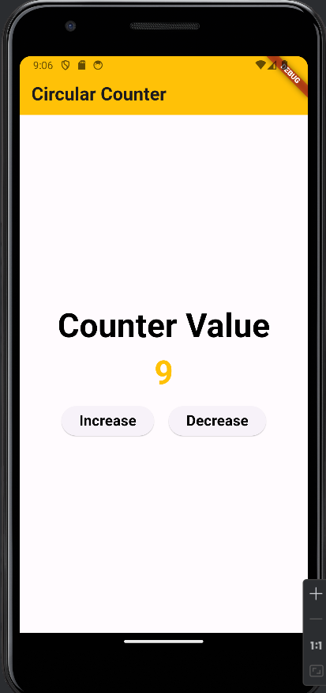

# circular_counter

A Circular Counter App using Flutter to practice fundamental widgets, state management, and implementing a circular counter logic.

##  UI

##  File Structure
lib-->feature-->presentation.dart
   |     |
   |     |
   |      -->domain-->Logic.dart
   |
    -->main.dart