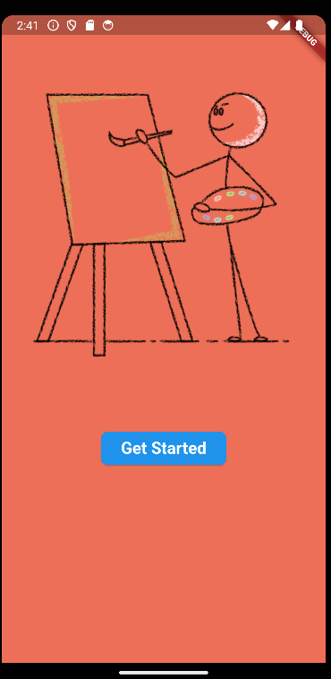
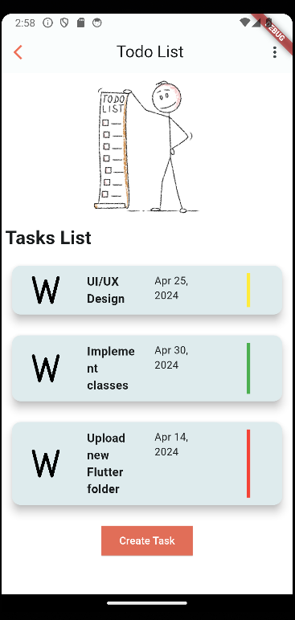
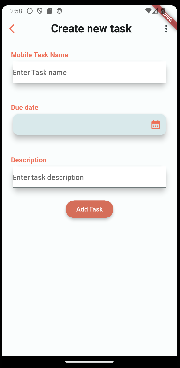
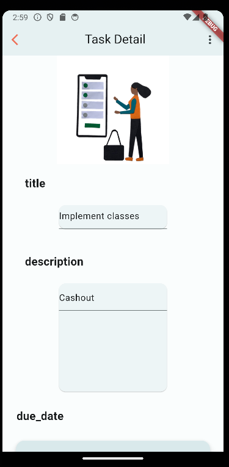
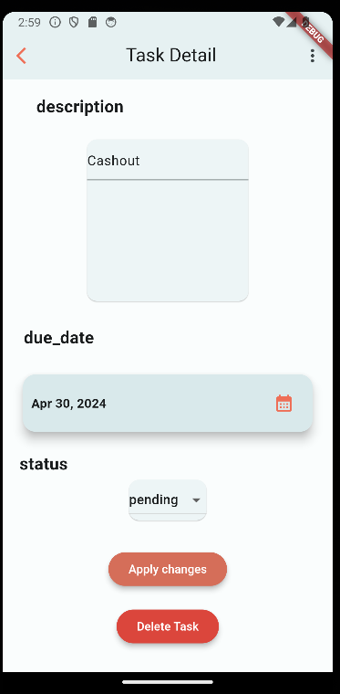

# todo_app

A task management application which allows users to create, update and delete tasks

##  UI

## packages
*   cupertino_icons: ^1.0.2
*   intl: ^0.19.0
*   path_provider: ^2.1.2
*   dartz: ^0.10.1

## Updates
* This application uses the Test Driven Architecture Which consists of features/data, features/domain and features/presentation
* The application also uses Either<L,R> to handle exceptions from user inputs in the create-task page and task-details page
* Widget testing is also available in the ./test/widget_test.dart
